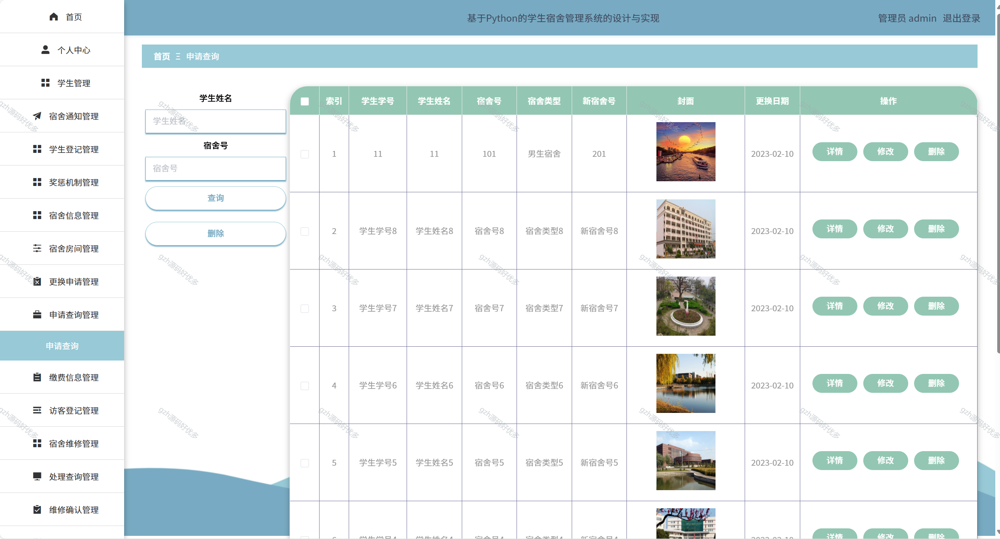

# python101
python101基于Python+Flask的学生宿舍管理系统
 
## 查看主页获取源码

### 一、关键词
学生公寓管理系统，宿舍住宿管理系统，学生寝室管理系统

### 二、作品包含
源码+数据库+全套环境和工具资源+本地部署教程

### 三、项目技术
前端技术：Vue2.0、Element-ui
后端技术：Python3.7、Flask

### 四、运行环境（以下版本亲测，其他版本兼容性请自行测试）
开发工具：PyCharm + VSCODE

数据库：MySQL5.7（最低要5.7版本）

数据库管理工具：Navicat10+

Python：Python3.7

前端Nodejs：14

浏览器：谷歌浏览器

### 五、项目介绍
项目编号：python0101

学生宿舍管理系统能高效处理宿舍分配、入住退宿等流程，减少人工操作误差，提升管理效率。它可实时记录学生住宿信息，方便查询床位使用、缴费等情况，助力管理人员快速掌握宿舍动态。同时，能整合报修、安全检查等功能，让宿舍问题处理更及时，为学生和管理者搭建便捷沟通桥梁。
基于 Python 的学生宿舍管理系统，可进行宿舍通知发布与管理，涵盖学生登记、信息维护，还能处理宿舍维修、缴费等事务，实现对学生宿舍多方面的信息化管理 。

### 六、运行截图

